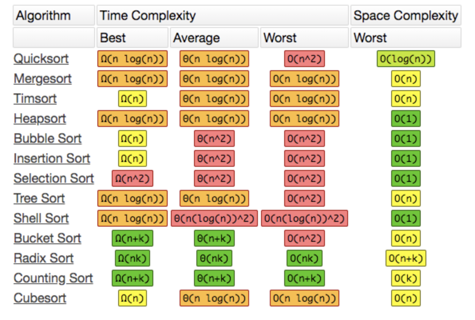

## Array.prototype.sort 各浏览器的算法实现

|浏览器 |使用的 JavaScript 引擎 |排序算法 |源码地址|
|----|----|----|----|
|Google Chrome |V8 |插入排序和快速排序 |sort 源码实现|
|Mozilla Firefox |SpiderMonkey |归并排序 |sort 源码实现|
|Safari |Nitro（JavaScriptCore ） |归并排序和桶排序 |sort 源码实现|
|Microsoft Edge 和 IE(9+) |Chakra |	快速排序 |sort 源码实现|

## 各种算法的对比
|排序类型| 	平均情况 |	最好情况 	|最坏情况 	|辅助空间 |	 稳定性|
|----|----|----|----|----|----|
|快速排序 |	O(nlogn)|O(nlogn) |	O(n²) | O(nlogn) | 不稳定|
|归并排序 |	O(nlogn)|O(nlogn) |	O(nlogn) |	O(n) |稳定|
|插入排序 |	O(n²) 	|O(n) 	  |  O(n²) 	|  O(1) |稳定|
|桶排序   |  O(n+k) |  O(n+k) |	 O(n²) | O(n+k)|(不)稳定|

## Array.prototype.sort()
* ES 规范并没有指定具体的算法，在 V8 引擎中，7.0 版本之前，数组长度小于 10 时，Array.prototype.sort() 使用的是插入排序，否则用快速排序
* 在 V8 引擎 7.0 版本后就舍弃了快速排序，因为它不是一种稳定的排序算法，在最坏情况下，时间复杂度会降级到 O(n^2)
* 而是采用了一种混合排序的算法：TimSort
    * 这种功能算法最初用于 Python 语言中，严格地说它不属于普通的 10 中排序算法中的任何一种，属于一种混合排序算法：
        * 在数据量小的子数组中使用插入排序，然后再使用归并排序将有序的子数组进行合并排序，时间复杂度为 O(nlogn)
